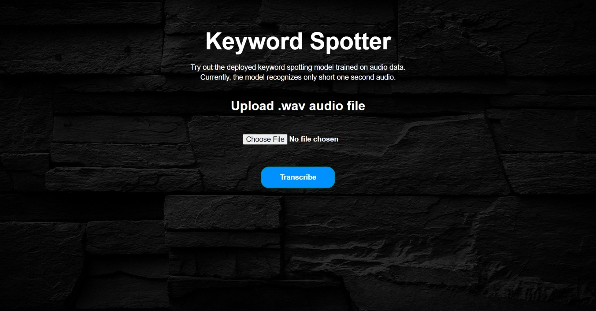
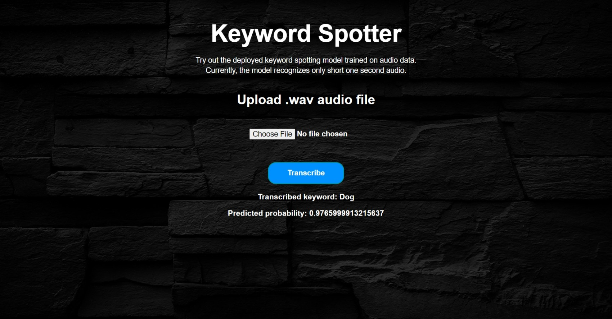

# End-to-End Keyword Spotting (KWS) with CI/CD Pipeline

This project promulgates a `pipeline` that `trains` an end-to-end keyword spotting model using input audio files, `tracks` experiments by logging the model artifacts, parameters and metrics, `build` them as a web application followed by `dockerizing` them into a container and deploys the application containing trained model artifacts as a docker container with `CI/CD` integration, automated tests and releases.

## Author

- [@ilia chiniforooshan](https://github.com/iliach1995)

## Languages and Tools
<div align="">
<a href="https://www.python.org" target="_blank" rel="noreferrer"></a>
<a href="https://www.tensorflow.org" target="_blank" rel="noreferrer"></a>
<a href="https://www.mlflow.org/docs/latest/python_api/mlflow.html" target="_blank" rel="noreferrer"> </a>
<a href="https://docs.pytest.org/en/7.1.x/" target="_blank" rel="noreferrer"></a> 
<a href="https://github.com/features/actions" target="_blank" rel="noreferrer"> </a>
<a href="https://www.docker.com/" target="_blank" rel="noreferrer"></a>
<a href="https://flask.palletsprojects.com/en/2.2.x/" target="_blank" rel="noreferrer"> </a>

</div>
 
<br>

## Directory structure

```
End-to-End-Keyword-Spotting-with-CI-CD-Pipeline
│
├── .github\
│   │
│   └── workflows\
│       └── tests.yaml
│
├── .vscode\
│   └── launch.json
│
├── artifacts\
│   │
│   ├── model\
│   │   │
│   │   ├── data\
│   │   │   │
│   │   │   ├── model\
│   │   │   │   │
│   │   │   │   ├── assets\
│   │   │   │   │
│   │   │   │   ├── variables\
│   │   │   │   │   ├── variables.data-00000-of-00001
│   │   │   │   │   └── variables.index
│   │   │   │   │
│   │   │   │   ├── fingerprint.pb
│   │   │   │   ├── keras_metadata.pb
│   │   │   │   └── saved_model.pb
│   │   │   │
│   │   │   ├── keras_module.txt
│   │   │   └── save_format.txt
│   │   │
│   │   ├── MLmodel
│   │   ├── conda.yaml
│   │   ├── python_env.yaml
│   │   └── requirements.txt
│   │
│   ├── tensorboard_logs\
│   │   │
│   │   ├── train\
│   │   │   └── events.out.tfevents.1697751968.DESKTOP-3A9L9H3.25540.0.v2
│   │   │
│   │   └── validation\
│   │       └── events.out.tfevents.1697752424.DESKTOP-3A9L9H3.25540.1.v2
│   │
│   │
│   └── model_summary.txt
│
├── config\
│   │
│   ├── __pycache__\
│   │   ├── __init__.cpython-310.pyc
│   │   └── config_type.cpython-310.pyc
│   │
│   ├── __init__.py
│   └── config_type.py
│
├── dataset\
│   │
│   ├── modeltest\
│   │   ├── bird.wav
│   │   ├── cat.wav
│   │   ├── dog.wav
│   │   ├── down.wav
│   │   ├── eight.wav
│   │   ├── go.wav
│   │   ├── off.wav
│   │   └── seven.wav
│   │
│   └── test\
│       ├── __init__.py
│       └── audio_test.wav
│
│
├── deploy\
│   ├── __init__.py
│   └── deployment.yaml
│
├── src\
│   │
│   ├── __init__.py
│   ├── audio_process.py
│   ├── data_preparation.py
│   ├── data_visualization.py
│   ├── experiment_tracking.py
│   ├── inference.py
│   ├── load_data.py
│   ├── main.py
│   ├── model_train.py
│   ├── parameters.py
│   └── train.py
│
├── static\
│   ├── bg.jpg
│   └── page.css
│
├── templates\
│   └── page.html
│
├── tests\
│   │
│   ├── __init__.py
│   └── pytest.py
│
├── .gitignore
├── Dockerfile
├── README.md
├── __init__.py
├── app.py
└── requirements.txt
```


## Motivation

`Deep learning/Machine learning` or `AI` (in short) is the current hot topic which has its application in most of the fields and it's demand is increasing day-by-day. But at this point, the sad truth is - `Only very less percentage of ML/DL models makes into production`. That's when `MLOps` comes into the picture. 

The major challenges with ML during development are:
  - Development, training and deployment environment can be different leading to dependency hassles.
  - Whenever input data changes, its becomes more tedious to reproduce the experiment.
  - Experiment tracking and analyzing can mostly be difficult and challenging.
  - Core ML code turn out to be spaghetti jungle which introduces lot of `boilerplate` codes.

MLOps is a budding field that productionalize ML models. `ML/DL` being a core research field, still misses out the `deployment` paradigm which includes design principles, patterns, testing, code styles etc. This restricts the domain to be used in the production environment efficiently. To nullify this, MLOps integrates DevOps principles into ML domain and serves as an intersection point of `Machine learning`, `Datascience` and `DevOps`.

## Description

The project is a concoction of `research` (audio signal processing, keyword spotting, ASR), `development` (audio data processing, deep neural network training, evaluation) and `deployment` (building model artifacts, web app development, docker) by integrating `CI/CD` pipelines with automated releases and tests.

## Technical facets

1. Training a deep end-to-end `CNN` neural network on `Google Speech command dataset` using `Tensorflow` to detect keywords or short one-second utterances.
2. Tracking the entire model training using `MLflow` from which  `trained model artifacts`, metrics and parameters are logged.
3. Building a web app using `Flask API` that provides an intuitive interface to make predictions from the trained model using real audio data.
4. Writing test cases to perform unit tests using `Pytest`.
5. Writing a `docker` file and pushing it along with other application files including source code, artifacts etc. to the `GitHub` repository.
6. Automating `CI/CD Pipeline` as follows:
    - Initialize `GitHub Actions` workflows for CI. This will automatically trigger the pipeline whenever it tracks a new commit to the repository.
    - Automated tests are perfomed using `Pytest` after every commit to the `main` branch.
    - Run the pipeline which builds the entire application along with the model to the docker image and then containerize into a `docker container`.
    - The user can access the app via `URL`. The app facilitates to upload an input short `audio .wav file`, in which the predicted keyword is returned from the model along with the probability and displayed as a result in the app UI/webpage.

7. The above points are only a technical gist of the entire application. More detailed explanation about each facet is described in the [pipeline section](#pipeline) below.

## Pipeline

[Keyword Spotting] (KWS) is the task of detecting a particular keyword from speech. Current voice-based devices such as **Amazon Alexa**, **Google Home** etc. first detect the predefined keywords (wakewords) from the speech locally on the device. When such keywords are detected, a full scale automatic speech recognizer is triggered on the cloud for further recognition of entire speech and processing. Traditional approaches for KWS are based on Hidden Markov Models with sequence search algorithms. The advancements in deep learning and increased data availability replaced them with deep learning based approaches as state-of-the-art.

### Configuration Management

Every application or project comprises of multiple configuration settings. In this case, all the data process and model configurations is stored in the ./config/config_type.py. Please feel free to make necessary changes to the paths and parameters, based on the requirement.

### Audio Data (speech signals) processing & Feature extraction

[Signal processing](https://arxiv.org/ftp/arxiv/papers/1305/1305.1925.pdf) is the process of transforming and extracting relevant information from the speech signal in an efficient way. Here, every audio will be represented as vectors constituting the amplitude of the sound wave in intervals of $1/16000$ of a second. [Google Speech command dataset](http://download.tensorflow.org/data/speech_commands_v0.02.tar.gz) via google/tensorflow is used for this project. It consists of over $85,000$ one-second long utterances. In our case, the model will be trained on $31$ keywords or short words.

Firstly, the audio has to be embedded into the vector space which constitutes the features to learn. To facilitate that, [Mel-Frequency Cepstral Coefficients](https://en.wikipedia.org/wiki/Mel-frequency_cepstrum) (MFCC) is the most common widely used, feature extraction technique for audio data. MFCCs are derived using `Fourier transform` and `log-Mel spectrogram`. More detailed mathematical explanation  can be found [here](https://en.wikipedia.org/wiki/Mel-frequency_cepstrum). In order to extract these features, `librosa` is used. [data_preparation.py](./src/data_preparation.py) contains the code for preprocessing audio and extracting features from them. It reads the audio file, compute MFCC and pad them for fixed-sized vector for all audio files as CNN cannot handle sequential data. In order to avoid any hassles in  loading and processing plethora of audio files, it's a good practice to dump them to `.npy` arrays, which makes it easier for further usage.

**Note:** Due to large file size, the training data (.npy) files are not uploaded in the repository. By running the code provided in [main.py](./src/main.py), you can download and preprocess the data. 

### CNN Model

The end-to-end model used in this project is based on a set of `2D convolutional layers` by a set of `fully connected layers`. The main advantage is, it uses `batch normalization` in the `convolutional layers`. The model that accepts `audio MFCC features` as input and outputs `label probabilities` to recognize keywords. 
`CNN` model has three `2D convolutional layers` with `maxpooling` and `batchnorm` layers for each. The outputs of the convolutional layer is fed the `fully connected dense layer` with `softmax layer` at the end. `ReLU` is the activation function for all layers. `Dropout` layers are added throughout the network for `regularization`. The model summary can be viewed from [here](./artifacts/model_summary.txt). [model_train.py](./src/model_train.py) defines the CNN model with `Tensorflow` and `Keras`. The model training is defined in [train.py](./src/train.py).

```
Model: "sequential"
_________________________________________________________________
 Layer (type)                Output Shape              Param #   
=================================================================
 reshape (Reshape)           (None, 99, 40, 1)         0         
                                                                 
 batch_normalization (Batch  (None, 99, 40, 1)         4         
 Normalization)                                                  
                                                                 
 re_lu (ReLU)                (None, 99, 40, 1)         0         
                                                                 
 conv2d (Conv2D)             (None, 99, 40, 32)        320       
                                                                 
 batch_normalization_1 (Bat  (None, 99, 40, 32)        128       
 chNormalization)                                                
                                                                 
 re_lu_1 (ReLU)              (None, 99, 40, 32)        0         
                                                                 
 max_pooling2d (MaxPooling2  (None, 49, 20, 32)        0         
 D)                                                              
                                                                 
 dropout (Dropout)           (None, 49, 20, 32)        0         
                                                                 
 conv2d_1 (Conv2D)           (None, 49, 20, 64)        18496     
                                                                 
 batch_normalization_2 (Bat  (None, 49, 20, 64)        256       
 chNormalization)                                                
                                                                 
 re_lu_2 (ReLU)              (None, 49, 20, 64)        0         
                                                                 
 max_pooling2d_1 (MaxPoolin  (None, 24, 10, 64)        0         
 g2D)                                                            
                                                                 
 dropout_1 (Dropout)         (None, 24, 10, 64)        0         
                                                                 
 conv2d_2 (Conv2D)           (None, 24, 10, 128)       73856     
                                                                 
 batch_normalization_3 (Bat  (None, 24, 10, 128)       512       
 chNormalization)                                                
                                                                 
 re_lu_3 (ReLU)              (None, 24, 10, 128)       0         
                                                                 
 max_pooling2d_2 (MaxPoolin  (None, 12, 5, 128)        0         
 g2D)                                                            
                                                                 
 dropout_2 (Dropout)         (None, 12, 5, 128)        0         
                                                                 
 conv2d_3 (Conv2D)           (None, 12, 5, 256)        295168    
                                                                 
 batch_normalization_4 (Bat  (None, 12, 5, 256)        1024      
 chNormalization)                                                
                                                                 
 re_lu_4 (ReLU)              (None, 12, 5, 256)        0         
                                                                 
 max_pooling2d_3 (MaxPoolin  (None, 6, 2, 256)         0         
 g2D)                                                            
                                                                 
 dropout_3 (Dropout)         (None, 6, 2, 256)         0         
                                                                 
 flatten (Flatten)           (None, 3072)              0         
                                                                 
 layer1 (Dense)              (None, 512)               1573376   
                                                                 
 re_lu_5 (ReLU)              (None, 512)               0         
                                                                 
 dropout_4 (Dropout)         (None, 512)               0         
                                                                 
 layer2 (Dense)              (None, 256)               131328    
                                                                 
 re_lu_6 (ReLU)              (None, 256)               0         
                                                                 
 dropout_5 (Dropout)         (None, 256)               0         
                                                                 
 dense (Dense)               (None, 31)                7967      
                                                                 
=================================================================
Total params: 2102435 (8.02 MB)
Trainable params: 2101473 (8.02 MB)
Non-trainable params: 962 (3.76 KB)
_________________________________________________________________
```

**Note:** A new method is added to the CNN class for the `transfer learning` using [YAMNet](https://tfhub.dev/google/yamnet/1). Note that the `transfer learning` model input should be `audio files` while the CNN model accepts `audio MFCC features`.

### MLflow - Model tracking

[MLflow](https://mlflow.org/) is an open source platform for managing end-to-end machine learning lifecycle. It provides functionality to track, log, register and deploy models. But in this project, MLflow is only used for experiment tracking and logging model artifacts with metrics and parameters. The artifacts can be found in [artifacts directory](./artifacts/).

[experiment_tracking.py](./src/experiment_tracking.py) provides the definition of `MLFlowTracker` user-defined dataclass which handles the entire MLflow tracking responsibility. The tracking, logging of model artifacts, parameters etc. are done by `MLFlowTracker` class. MLflow library provides an UI - `mlflow ui` through which all model experiments (runs) can be viewed. The model selection process is done by:

|  |
|:--:|
| <b>Figure 1: Model selection via MLflow UI</b>|

### Pytest

[Pytest](https://docs.pytest.org/en/7.1.x/) framework makes it easy to write small, readable tests, and can scale to support complex functional testing for applications and libraries. [tests](./tests/) directory contains all the test cases defined. Currently, test cases are written only for some scenarios but more tests can also be added. For the automation part, please refer to [GitHub Actions](#github-actions).

### FLASK API

[Flask](https://flask.palletsprojects.com/en/1.1.x/) is a micro web framework for creating APIs in Python. It is a simple yet powerful web framework with the ability to scale up to complex applications. 

[app.py](./app.py) creates a web application that wraps the trained model to be used for `inferencing` using `real audio data` by means of `FLASK`. It facilitates the application to run from a server which defines every routes and functions to perform. Instead of predicting from a script, it'll be more intuitive to predict from a `GUI`. The front-end is designed using `HTML` scripts from the [templates directory](./templates/) and the page styles are defined in `CSS` in [static directory](./static/).

|  |
|:--:|
| <b>Figure 1a: App demo for predicting keyword</b>|

|  |
|:--:|
| <b>Figure 1b: App demo for predicted keyword and predicted probability</b>|

### CI/CD Pipeline

[Continuous Integration and Continuous Deployment (CI/CD)](https://neptune.ai/blog/ways-ml-teams-use-ci-cd-in-production) are the core practices in `MLOps` that are embraced from `DevOps`. CI is the process of automating the building and testing of code every time it is committed with version control (Git) and pushed to the same repository. CD is the process of automating the deployment of the application to the production environment. The tools and components used in this project for CI/CD are described below: 

### Docker

Now, the model artifacts are ready and are built into an web API, it's the time for deployment to host this application. To facilitate them a step further, `docker` would be a great tool.  [Docker](https://www.docker.com/) eases the developers to package applications or software which can be easily reproduced on another machine. It uses containers to pack any applications with its dependencies to deploy in another environment. Generally, it is not a mandatory tool or step for deployment as it can also be done without dockers but they serve many purpose like portability, scalability, version control, no dependency hassles etc. Thus, docker is a great tool in the deployment cycle.

The main idea of using docker in this project is, to package and build a `docker image` from the FLASK application with necessary files and containerize them into a `docker container` which can be deployed in any server. [Dockerfile](./Dockerfile) contains all the commands needed to build an image. The `docker` serves as a bridge in the `CI/CD` pipeline between the web app and cloud server.

### GitHub Actions

[GitHub Actions](https://docs.github.com/en/actions/learn-github-actions/understanding-github-actions) is a CI/CD platform which facilitates in automating the build, test, and deployment pipeline. Workflows can be created for building and testing every commit or pull request to the Git repository, or deploy merged pull requests to production. In our case, whenever the repository tracks a new commit, it triggers the CI/CD workflow pipeline. 

`./github/workflows` defines the workflows that are needed to run the pipeline whenever triggered by an event. **One** workflows are defined and used as follows:
  - `tests.yaml` automates all test cases defined in [tests](./tests/) during every commit.

## Run locally

Clone the project

```bash
  git clone <repository_url>
```

Navigate to the project directory

```bash
  cd <cloned_repository_name>
```

Install `requirements.txt`
```bash
  pip install -r requirements.txt
```

To run inference locally,

```bash
  python -m src/inference.py
```

To run tests locally,

```bash
  python -m pytest
```

To run app locally,
```bash
  python -m app.py
```

**Note:** To run locally via docker container , build image from [Dockerfile](./Dockerfile) and  run the container using `docker build` and `docker run` commands.

## What's next?

- Implement data management pipeline for data extraction, validation, data version control etc.
- Use cloud storage services like `Amazon S3 bucket` to store data, artifacts, predictions and so on.
- Orchestrate the entire workflow or pipeline by means of orchestration tools like `Airflow, KubeFlow, Metaflow`. As this is a small personal project with static dataset, the workflow can be created using normal function calls. But for large, scalable, real-time project, it is crucial and predominant to replace these with orchestration tools for real workflows.
- Implement `Continuous Training (CT)` pipeline along with `CI/CD`.

## Feedback

If you have any feedback, please reach out to me at ilia.chiniforooshan@gmail.com